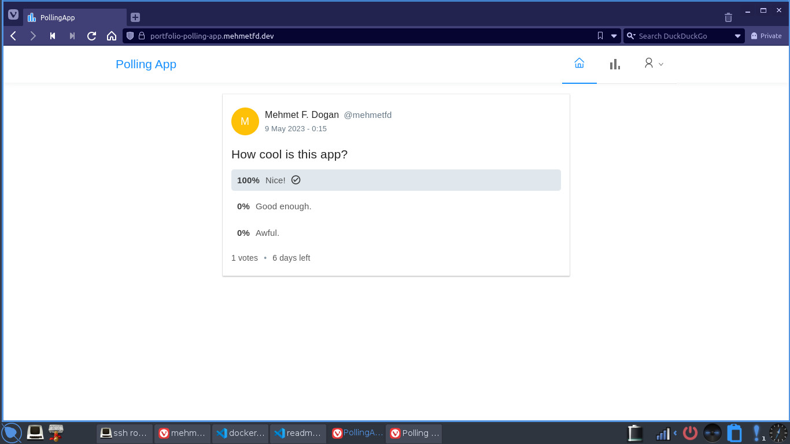

# 🎉 Welcome to PollingApp

📝 This is a polling application that uses React and Spring. With this application, users can create polls and vote on them.

## Screenshots



💻 To get started, make sure you have Docker installed on your machine. Once that's done, run the following command:

```bash
docker-compose up 
```

🚀 This will launch the app and you can access it at `http://localhost:9090`.

📈 Happy polling!
